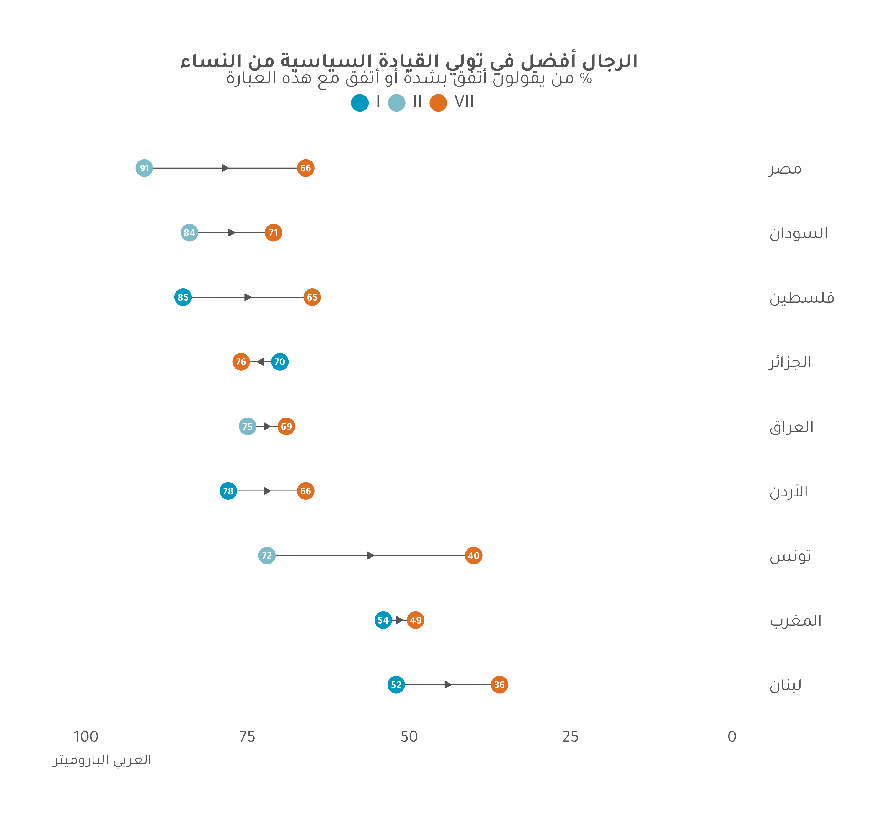

# Translating Arabic Plots {#arabic-translation}

This chapter reviews how to "translate" custom English plots to custom Arabic plots, and emphasizes points at which you may run into trouble. It is unreasonable to try to predict all custom plots, but regardless of the exact type of plot, there are certain consistencies we can still review. If you are having an issue with creating an Arabic plot with one of the `plot_` functions from the `ArabBarometR` package, please see Chapter \@ref(arabic-issues-package).

For this chapter, we are going to create a dumbbell plot showing the change in views regarding women in politics overtime. This graph cannot be created with the `ArabBarometR` package. It must be created "by hand". The graph will first be created in English, then translated into Arabic^[A note on English graph prioritization: Creating graphs in English first (and English being the default in the `ArabBarometR` package) is useful because the proof-of-concept should address the easiest case first. Arabic graphs are trickier than English graphs. If we cannot create the graph in English, it is unlikely we will be able to create the graph in Arabic. This should not be seen as a preference for English graphs at Arab Barometer, rather as a consequence of R's fundamental catering towards Western European culture.].

This is NOT meant to be a guide or reference for creating dumbbell plots. The goal is to highlight necessary changes when translating a graph from English to Arabic. Therefore, the section demonstrating the code for an English graph will have minimal instruction. The English code simply serves as a reference for the Arabic section.

Furthermore, since this is a demonstration graph and is not being used in production, we do not need to discuss the merits of design choices here. There are a number of different ways to visualize this data, but that is not the point of this chapter. The point of this chapter is to see how English graphs can be translated into Arabic.

## English Code


### Create a Data Frame

The first step for any plot is to create the data frame you wish to plot. Since we are comparing data from the first two waves to wave seven, we need to load and subset the trend data.


```{r arabic-tranlation-1, eval=FALSE}

trend_data_ENG <- haven::read_dta("path/to/trend/data")

all_waves_ENG <- trend_data_ENG %>%
  split(f = .$WAVE)

```

Now we have a list of data frames according to wave, stored in the variable `all_waves_ENG`.

The next step is to calculate the summary of `Q601_3` by country for each wave. We can do that using the `calculate_smry_comp()` function from the `ArabBarometR` package.

```{r arabic-translation-2}
wave7_Q6013 <- abwave7_eng %>%
  calculate_smry_comp("Q601_3") %>%
  mutate(Wave = "VII") %>%
  mutate(Country = as.character(Country))

wave1_Q6013 <- all_waves_ENG$`1` %>%
  calculate_smry_comp("Q601_3") %>%
  mutate(Wave = "I") %>%
  mutate(Country = as.character(Country))

wave2_Q6013 <- all_waves_ENG$`2` %>%
  calculate_smry_comp("Q601_3") %>%
  mutate(Wave = "II") %>%
  mutate(Country = as.character(Country))
```

Currently, there is no way to distinguish which summaries belong to which wave. Every data frame has one column names `Country` and one column named `Q601_3`. Let's add a distinguishing column. Also, to save ourselves a headache later, let's convert `Country` from a labelled double to a character.

```{r arabic-translation-3}
wave7_Q6013 <- wave7_Q6013 %>%
  mutate(Wave = "VII",
         Country = as.character(Country))

wave1_Q6013 <- wave1_Q6013 %>%
  mutate(Wave = "I",
         Country = as.character(Country)) 

wave2_Q6013 <- wave2_Q6013 %>%
  mutate(Wave = "II",
         Country = as.character(Country))
```

Some countries were surveyed both in Wave I and Wave II. We only want to compare the earliest point at which the country is surveyed to the latest point at which the country was surveyed. Thus, we filter out countries from Wave II which appeared in Wave I.


```{r arabic-translations-4}
early_waves <- rbind(wave1_Q6013,
                     wave2_Q6013)  %>%
  group_by(Country) %>%
  slice(1) %>%
  ungroup()
```

Now, we know some countries were surveyed in Wave VII that were not surveyed in Waves I or II. Similarly, some countries were surveyed in Waves I or II but not in Wave VII. We cannot compare the responses from Wave VII to Wave I or II if the country was not surveyed, so we need to limit our summaries to countries which were surveys in Wave VII and Wave I or II.

```{r arabic-translations-5}
countries <- intersect(wave7_Q6013$Country,
                       early_waves$Country)

wave7_Q6013 <- wave7_Q6013 %>%
  filter(Country %in% countries)

early_waves <- early_waves %>%
  filter(Country %in% countries)
```

The (nearly) last step is to combine the `early_waves` data frame and the `wave7_Q6013` data frame, and re-order the columns (why we want to re-order the columns will become clear in a moment).

```{r arabic-translation-6}
Q6013_trend <- rbind(wave7_Q6013,
                      early_waves) %>%
  relocate(Wave, .before = Q601_3)
```

With this data frame, we can use the `plot_demographic_smry_comp()` function from the `ArabBarometR` package. The order of the columns matters for this function. The `plot_demographic_smry_comp()` function expects output in the same form the `calculate_demographic_smry_comp()` function outputs. That is, the columns from left to right should be a country column, a demographic column, and a percent column. That is the order of `Q6013_trend`, so we can plug it into `plot_demographic_smry_comp()`.

```{r arabic-translation-7, fig.dim=c(13,12)}

plot_demographic_smry_comp(Q6013_trend,
                           .caption = "Arab Barometer Waves I, II, VII",
                           .language = "en")

```

But this chapter is not for `plot_` functions from the `ArabBarometR` package, so let's continue.

Before creating the dumbbell plot for `Q6013_trend`, let's do one more calculation that will allow us to include arrows pointing in the direction of opinion change over the years.

```{r arabic-translation-8}
Q6013_trend <- Q6013_trend %>%
  tidyr::pivot_wider(names_from = "Wave",
                     values_from = "Q601_3") %>%
  mutate(one2seven = abs(VII - I)/2 + pmin(VII,I),
         two2seven = abs(VII - II)/2 + pmin(VII,II),
         midpoint = coalesce(one2seven,two2seven)) %>%
  select(!c(one2seven,two2seven)) %>%
  tidyr::pivot_longer(cols = c(VII,II,I),
                      names_to = "Wave",
                      values_to = "Q601_3") %>%
  filter(!is.na(Q601_3))
```

Now, we are ready to create our dumbbell plot.

### Plot the Data Frame

There will not be a detailed explanation of what each line of the code does to plot the data. The point of this chapter is not to explain how to create dumbbell plots. The point is to re-create a custom English plot in Arabic.

```{r arabic-translations-9, fig.dim=c(13,12)}

# Data Frame:
Q6013_trend %>% 
  
  # ggplot base
  ggplot(aes(x = Q601_3, y = reorder(Country,Q601_3))) +
  
  # ggplot line for connecting the points
  geom_line(aes(group = Country),
            color = "#545454") +
  
  # ggplot arrow pointing in the direction of change
  geom_segment(data = ~subset(.x, Wave == "I"|Wave == "II"), 
               aes(
                 x = midpoint,
                 xend = midpoint + .5 * sign(midpoint - Q601_3), 
                 yend = Country), 
               arrow = arrow(angle = 30, length = unit(.1, "inches"), type = "closed"), 
               color = "#545454") +
  
  # ggplot points
  geom_point(aes(color = Wave),
             size = 8) +
  
  # setting the colors of the points
  scale_color_manual(values = c("#0098BE","#7CBBC7","#DF6E21"))+
  
  # adding the percent value to the points
  geom_text(aes(label = ifelse(Q601_3 == 0, "<1", Q601_3),
                family = 'Montserrat'),
            color = "white",
            fontface = "bold",
            size = 4,
            position = position_dodge(width = 1)) +
  
  # showing the whole scale from 0 to 100
  scale_x_continuous(limits = c(0,100)) +
  
  # adding a title and subtitle
  labs(
    title = stringr::str_wrap(
      title_function(TRUE,
                     "Q601_3",
                     "English",
                     "comparative"),
      50),
    subtitle = subtitle_function(TRUE,
                                 "Q601_3",
                                 "English",
                                 "comparative"),
    caption = "Arab Barometer Wave I, II, VII"
  ) +
  
  # using the Arab Barometer branded theme
  theme_ab_english()


```

## Arabic Code

Again, the first step is to create the data frame we want to plot, this time with the Arabic data.

### Create a Data Frame

```{r arabic-translation-11, fig.dim=c(13,12),eval=FALSE}

trend_data_ARA <- haven::read_dta("path/to/trend/data")

all_waves_ARA <- trend_data_ARA %>%
  split(f = .$WAVE)

```

Since the process for creating the data frame is the same, regardless of language, all of it is presented here succinctly.

```{r arabic-translation-12, fig.dim=c(13,12)}

wave7_Q6013 <- abwave7_ara %>%
  calculate_smry_comp("Q601_3") %>%
  mutate(Wave = "VII") %>%
  mutate(Country = as.character(Country))

wave1_Q6013 <- all_waves_ARA$`1` %>%
  calculate_smry_comp("Q601_3") %>%
  mutate(Wave = "I") %>%
  mutate(Country = as.character(Country))

wave2_Q6013 <- all_waves_ARA$`2` %>%
  calculate_smry_comp("Q601_3") %>%
  mutate(Wave = "II") %>%
  mutate(Country = as.character(Country))

early_waves <- rbind(wave1_Q6013,
                     wave2_Q6013)  %>%
  group_by(Country) %>%
  slice(1) %>%
  ungroup()

countries <- intersect(wave7_Q6013$Country,
                       early_waves$Country)

wave7_Q6013 <- wave7_Q6013 %>%
  filter(Country %in% countries)

early_waves <- early_waves %>%
  filter(Country %in% countries)

Q6013_trend <- rbind(wave7_Q6013,
                      early_waves) %>%
  relocate(Wave, .before = Q601_3) %>%
  tidyr::pivot_wider(names_from = "Wave",
                     values_from = "Q601_3") %>%
  mutate(one2seven = abs(VII - I)/2 + pmin(VII,I),
         two2seven = abs(VII - II)/2 + pmin(VII,II),
         midpoint = coalesce(one2seven,two2seven)) %>%
  select(!c(one2seven,two2seven)) %>%
  tidyr::pivot_longer(cols = c(VII,II,I),
                      names_to = "Wave",
                      values_to = "Q601_3") %>%
  filter(!is.na(Q601_3))
```

Now for plotting.

### Plot the Data Frame

Unlike creating the data frame, you cannot simply plug the Arabic data frame in for the English data frame and call it a day. The code below is exactly the code from creating the English graph, only the Arabic data frame is being piped in. The code chunk is numbered. When referencing lines of code, this is the code chunk being referred to.

```{r arabic-translations-13, fig.dim=c(13,12), attr.source='.numberLines'}

# Data Frame:
Q6013_trend %>% 
  
  # ggplot base
  ggplot(aes(x = Q601_3, y = reorder(Country,Q601_3))) +
  
  # ggplot line for connecting the points
  geom_line(aes(group = Country),
            color = "#545454") +
  
  # ggplot arrow pointing in the direction of change
  geom_segment(data = ~subset(.x, Wave == "I"|Wave == "II"), 
               aes(
                 x = midpoint,
                 xend = midpoint + .5 * sign(midpoint - Q601_3), 
                 yend = Country), 
               arrow = arrow(angle = 30, length = unit(.1, "inches"), type = "closed"), 
               color = "#545454") +
  
  # ggplot points
  geom_point(aes(color = Wave),
             size = 8) +
  
  # setting the colors of the points
  scale_color_manual(values = c("#0098BE","#7CBBC7","#DF6E21"))+
  
  # adding the percent value to the points
  geom_text(aes(label = ifelse(Q601_3 == 0, "<1", Q601_3),
                family = 'Montserrat'),
            color = "white",
            fontface = "bold",
            size = 4,
            position = position_dodge(width = 1)) +
  
  # showing the whole scale from 0 to 100
  scale_x_continuous(limits = c(0,100)) +
  
  # adding a title and subtitle
  labs(
    title = stringr::str_wrap(
      title_function(TRUE,
                     "Q601_3",
                     "English",
                     "comparative"),
      50),
    subtitle = subtitle_function(TRUE,
                                 "Q601_3",
                                 "English",
                                 "comparative"),
    caption = "Arab Barometer Wave I, II, VII"
  ) +
  
  # using the Arab Barometer branded theme
  theme_ab_english()


```

#### English to Arabic Text {-}

There are several obvious issues with the graph. Most blatantly, the title, subtitle, and caption are in English. This is changed by changing lines 40 - 50.

```{r arabic-translation-14,eval=FALSE}
# English Titles
title = stringr::str_wrap(
  title_function(TRUE,
                 "Q601_3",
                 "English",
                 "comparative"),
  50),
subtitle = subtitle_function(TRUE,
                             "Q601_3",
                             "English",
                             "comparative"),
caption = "Arab Barometer Wave I, II, VII"

# Arabic Titles
title = stringr::str_wrap(
  title_function(TRUE,
                 "Q601_3",
                 "Arabic",
                 "comparative"),
  60),
subtitle = subtitle_function(TRUE,
                             "Q601_3",
                             "Arabic",
                             "comparative"),
caption = "الباروميتر العربي"

```

Of course, this is only if you want to use a "pre-made" title. If you are coming up with your own title, you do not have to use the title and subtitle functions.

```{r arabic-translation-15,eval=FALSE}
# Arabic Titles
title = stringr::str_wrap(
  "الرجال أفضل في تولي القيادة السياسية من النساء",
  50),
subtitle = "% من يقولون أتفق بشدة أو أتفق مع هذه العبارة",
caption = "الباروميتر العربي"

```

#### Right to Left {-}

Arabic graphs are read right to left, so the x- and y-axis labels must be reflected.

To change the direction of the x-axis, we must change line 36.

```{r arabic-translation-16,eval=FALSE}

# English x-axis
scale_x_continuous(limits = c(0,100))

# Arabic x-axis
scale_x_reverse(limits = c(100,0))

```

To change the y-axis labels, we need to add a line.

```{r arabic-translations-17,eval=FALSE}

# Arabic y-axis
scale_y_discrete(position = "right")

```

#### Point Labels {-}

A subtle change in English to Arabic graphs it the font. The AB brand font for English is Montserrat, and the brand font for Arabic is Tajawal. While the font for the text is controlled by the theme (discussed in the following section), the labels on the graph are separate. The code defining the labels on the graph is found on lines 28-33.

```{r arabic-translation-18,eval=FALSE}

# English
geom_text(aes(label = ifelse(Q601_3 == 0, "<1", Q601_3),
                family = 'Montserrat'),
            color = "white",
            fontface = "bold",
            size = 4,
            position = position_dodge(width = 1))

# Arabic
geom_text(aes(label = ifelse(Q601_3 == 0, "1>", Q601_3),
                family = 'Tajawal'),
            color = "white",
            fontface = "bold",
            size = 4,
            position = position_dodge(width = 1))

```

Aside from changing the font, the direction of the "less than" sign is also changed.

#### Arabic Theme

Finally, the `ArabBarometR` package provides separate ggplot themes for English and Arabic graphs. The theme controls the font, size, and placement of title elements. See line 54.

```{r arabic-translation-19}

# English
theme_ab_english()

# Arabic
theme_ab_arabic()

```

With that, we can translate the graph.

### Translated Graph

```{r arabic-translation-20, fig.dim=c(13,12),echo=FALSE}

reverse_sentence <- function(str1){
  paste(rev(strsplit(str1, "\\s+")[[1]]), collapse= " ")
}

arabic_title <- title_function(TRUE,
                     "Q601_3",
                     "Arabic",
                     "comparative")
arabic_title <- reverse_sentence(arabic_title)

arabic_subtitle <- subtitle_function(TRUE,
                     "Q601_3",
                     "Arabic",
                     "comparative")
arabic_subtitle <- stringr::str_remove(arabic_subtitle," %")
arabic_subtitle <- reverse_sentence(arabic_subtitle)
arabic_subtitle <- paste0(arabic_subtitle," %")
```


```{r arabic-translation-21, fig.dim=c(13,12)}
Q6013_trend %>% 
  
  # ggplot base
  ggplot(aes(x = Q601_3, y = reorder(Country,Q601_3))) +
  
  # ggplot line for connecting the points
  geom_line(aes(group = Country),
            color = "#545454") +
  
  # ggplot arrow pointing in the direction of change
  geom_segment(data = ~subset(.x, Wave == "I"|Wave == "II"), 
               aes(
                 x = midpoint,
                 xend = midpoint + .5 * sign(midpoint - Q601_3), 
                 yend = Country), 
               arrow = arrow(angle = 30, length = unit(.1, "inches"), type = "closed"), 
               color = "#545454") +
  
  # ggplot points
  geom_point(aes(color = Wave),
             size = 8) +
  
  # setting the colors of the points
  scale_color_manual(values = c("#0098BE","#7CBBC7","#DF6E21"))+
  
  # adding the percent value to the points
  geom_text(aes(label = ifelse(Q601_3 == 0, "1>", Q601_3),
                family = 'Tajawal'),
            color = "white",
            fontface = "bold",
            size = 4,
            position = position_dodge(width = 1)) +
  
  # showing the whole scale from 0 to 100
  scale_x_reverse(limits = c(100,0)) +
  scale_y_discrete(position = "right") +
  
  # adding a title and subtitle
  labs(
    title = stringr::str_wrap(
      arabic_title,
      60),
    subtitle = arabic_subtitle,
    caption = "الباروميتر العربي"
  ) +
  
  theme_ab_arabic()


```


```{r arabic-translation-22, fig.dim=c(13,12),echo=FALSE}

```